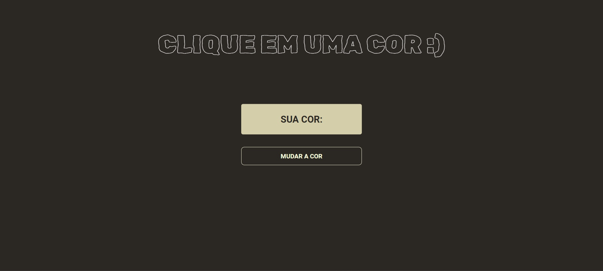
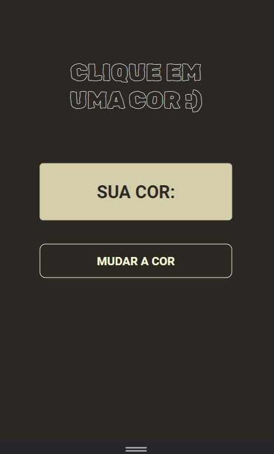

# 📋 Indíce

- [Bem-vindo](#id01)
- [Proposta](#id02)
- [Desafio](#id03)
- [Aprendizado](#id04)
- [Prosseguimento](id05)
- [Screenshots](#id06)
- [Links](#id07)
- [Tecnologias utilizadas](#id08)
- [Pré-requisitos](#id09)
- [Procedimentos de instalação](#id010)
- [Informações](#id011)

# Bem-vindo! 👋 <a name="id01"></a>

**Botão Cromático**
<br />

## 🚀 Proposta <a name="id02"></a>

A proposta deste projeto é oferecer uma experiência interativa ao usuário, permitindo que ele experimente diferentes cores de fundo com apenas um clique. Além disso, o projeto visa demonstrar como utilizar JavaScript para manipular elementos HTML e CSS dinamicamente, proporcionando uma interação fluída e responsiva.
<br />

## :trophy: Desafio <a name="#id03"></a>

O desafio principal deste projeto foi integrar corretamente as tecnologias HTML, CSS e JavaScript para criar uma aplicação funcional e esteticamente agradável. Isso incluiu a definição e estilização dos elementos HTML, a implementação da lógica de mudança de cor no JavaScript e a garantia de que a aplicação seja responsiva em diferentes dispositivos.

## :trophy: Aprendizado <a name="#id04"></a>

#### Construído com:

- Integração de Tecnologias: HTML, CSS e JavaScript para criar uma aplicação web interativa.

- Manipulação de Estilos com JavaScript: Manipulação de estilos CSS dinamicamente usando JavaScript para criar uma experiência de usuário mais envolvente.

- Gestão de Eventos: Gestão de eventos em JavaScript, especialmente no uso do método addEventListener para detectar e responder a eventos de clique.

- Utilização do SASS: Uso do pré-processador SASS para escrever estilos CSS de forma mais eficiente e organizada, facilitando a manutenção do código.

## :trophy: Prosseguimento <a name="id05"></a>

- Realizar outros projetos utilizando o React.js

# :camera_flash: Screenshots <a name="id06"></a>

## :video_camera: Video

arrastar video aqui

## :desktop_computer: Desktop design



## :iphone: Mobile design



<br />

# :heavy_check_mark: Links <a name="id07"></a>

<br />

- Para acessar o site [Clique aqui](https://66144005db94c2194113240a--timely-kleicha-fbb8ff.netlify.app/)

<br />

# 🛠 Tecnologias utilizadas <a name="id08"></a>

<br />

- JavaScript
- Git
- CSS (com SASS)
- Mixins
- Variáveis CSS
- HTML5

<br />

# ☑️ Pré-requisitos <a name="id09"></a>

<br />

- [x] Editor de código de sua preferência (recomendado VS code)
- [x] Git

<br />

# 📝 Procedimentos de instalação <a name="id010"></a>

<br />

Clone este repositório usando o comando:

```bash
git clone https://github.com/RaizaCirne/botao-cromatico.git
```

Baixar arquivo zip

Extrir arquivos

Abrir pasta no editor de código.

<br />

# :sunglasses: Informações <a name="id011"></a>

<br />

- Personal Page - [Raíza Cirne Braz](https://66144005db94c2194113240a--timely-kleicha-fbb8ff.netlify.app/)
- Frontend Mentor - [@RaizaCirne](https://www.frontendmentor.io/profile/RaizaCirne)
- GitHub - [RaizaCirne](https://github.com/RaizaCirne)
- LinkedIn - [Raíza Cirne Braz](https://www.linkedin.com/in/ra%C3%ADzacirne/)

**JavaScript - GIT - SASS - CSS3 - HTML5** 🚀
